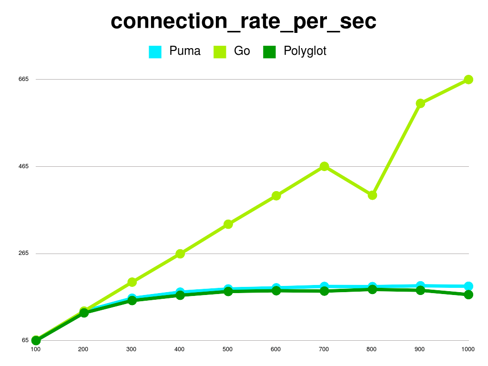
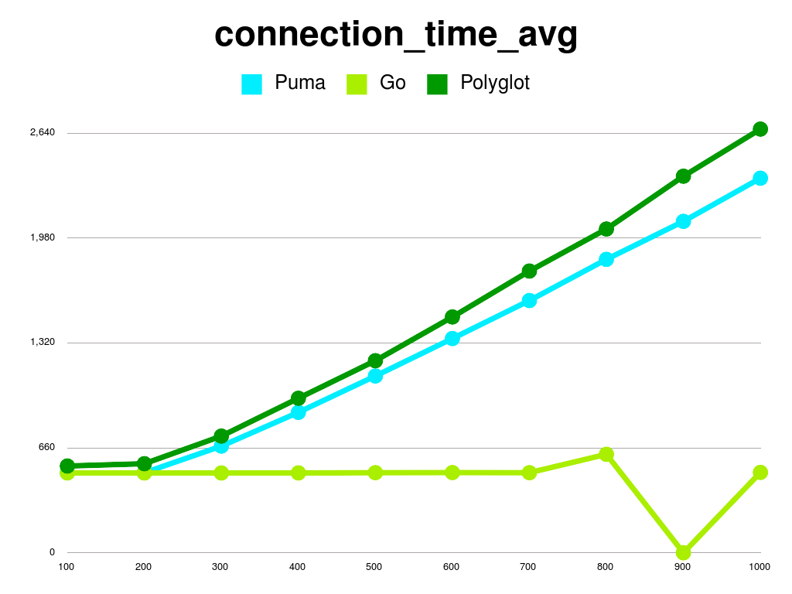
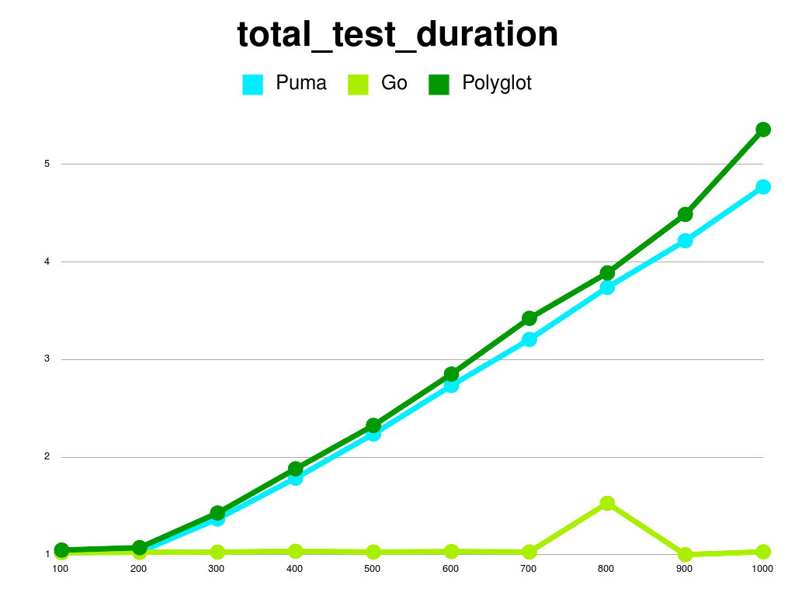
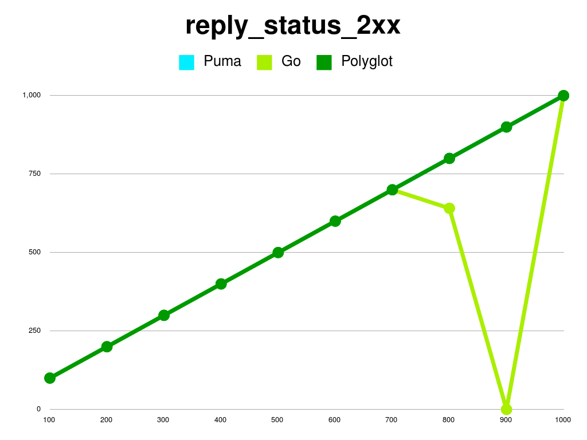

# Polyglot

_Polyglot is experimental software. Please use with caution and at your own risk!_

## Language wars and dependency hell

Programming language wars have been going on since the beginning of time. On a given day, there are at least half a dozen of threads on [Hacker News](https://hn.algolia.com/?q=programming+language#!/story/last_24h/0/programming%20language) discussing the merits of or introducing some new programming language. Every programmer has his or her own ideas of what the best programming language is for him or her (and for everyone else too, of course). Which is the fastest, most expressive, most secured, has the smallest code base, easiest to maintain etc? (_Ruby is da best!_)

[Dependency hell](http://en.wikipedia.org/wiki/Dependency_hell) is something most programmers will encounter after a while. Software libraries that your application depend on often get updated. Your application will need to grow too, and might need to use new libraries or new versions of the existing libraries. But wait! You just discovered that you cannot use the new version because another library you use depends on the older version. To upgrade, you'll need to revamp your application to use the new libraries. And of course, by the time you did, it's probably need to upgrade the libraries again.

Programmers use [web frameworks](http://en.wikipedia.org/wiki/Web_application_framework) to simplify the effort to develop web applications. Web frameworks are software libraries that reduce the overhead of work that needs to be done in most web applications. This reduces time and effort needed, improving stability and creating a consistent and maintainable system. As with any software library, web  frameworks are written in a single, major programming language, like Ruby with Ruby on Rails, Python with Django, Java with Spring or Javascript with Angular.js. Understandably, where web frameworks go, there goes the language wars and dependency hell too. Anyone migrating from a previous version of a web framework to a newer one can attest to the pain this entails. 

Wouldn't it be nice if we all just learn to live together?


## Polyglot

**Polyglot** is a web framework that let us just do that.

Polyglot allows programmers to collaborate and develop a single web application using multiple programming languages, libraries, environments and even different versions of the same language. 

What does this mean? 

It means no more programming language wars -- programmers can use the best language for the job and/or their favorite language to write different parts of the same web application.

It also means no dependency hell. Different parts of the same web application can use different libraries. Because of this, adding new features can use new libraries without upgrading the entire library.


### A complex web framework 

So what's the catch? There must be a catch, and there is certainly one. Polyglot *increases* the complexity in the effort to develop web applications. Unlike frameworks like Rails or Django or Express, Polyglot doesn't exist to make life easier for the programmer. 

As a programmer you trade complexity and effort for something you think is more important for the web application you're creating. In Polyglot, we are trading complexity and effort for:

1. **Performance scalability** -- Polyglot responders are distributed and independent processes that can reside anywhere on a connected network
2. **Extensibility** -- by creating an acceptor as a controller in an existing web application, you can extend the applications through Polyglot
3. **Multi-lingual, independent development** -- Polyglot responders can be developed independently in different programming languages, libraries and environments

*Polyglot* is not for all types of web applications. You should only use Polyglot for web applications that need to be scale in a highly performant way and/or need to be incrementally developed in multiple programming languages. For example, if your web application never needs to scale beyond a single server, you're probably better off using some other single language framework. And if once you create your web application and you or anyone else never need to add new features, Polyglot is probably not for you either. 

The first two are understandable, but the third is quite strange, why would you want to develop a web application in multiple programming languages? There are good, practical reasons:

1. Web applications you write are systems and they change over time and can be written or maintained by different groups of people. If you're not restricted to a particular platform or language, then the chances of getting an incrementally better piece of software is higher. 
2. Also, using different programming languages allows you to separate the layers and make each component more independent and robust. You can switch out the poor-performing responders and replacing them with higher-performing ones
3. Different responders can have different criteria for performance, ease-of-development, ease-of-maintenance or quick turnaround in development. With a single programming language you are often forced to accept a compromise. With multiple programming languages, you can choose the platform and language as what you need for that particular responder
4. Different responders can be written for specific performance gains or maintenability.


Is Polyglot for your web application? 

## Architecture

Polyglot has a very simple and basic architecture. It consists of 3 main components:

1. **Acceptor** - the acceptor is a HTTP interface that takes in a HTTP request and provides a HTTP response. The acceptor takes in a HTTP request converts it into a generic message and drops it into the message queue. Then depending on what is asked, it will return the appropriate HTTP response. The default implementation of the acceptor is in Go. To extend an existing web application, you can implement the acceptor as a controller in that web application.
2. **Messsage queue** - a queue that receives the messages that represent the HTTP request. the acceptor accepts HTTP requests and converts the requests into messages that goes into the message queue. The messages then gets picked up by the next component, the responder. The implementation of the message queue is a RabbitMQ server.
3. **Responder** - the responder is a standalone process written in any language that picks up messages from the message queue and responds to it accordingly. In most web frameworks this is usually called the controller. However unlike most web framework controllers, the responders are actual independent processes that can potentially sit in any connected remote server. Responders contain the "business logic" of your code. 

Essentially, the Polyglot architecture revolves around using a messaging queue to disassociate the processing units (responders) from the communications unit (acceptor), allowing the responders to be created in multiple languages.

###Flow

There are two basic types of flows in Polyglot.

The normal flow goes like this:

1. Client sents a HTTP request to the acceptor
2. The acceptor converts the request into JSON and adds the JSON message into the message queue, and waits for a response
3. A responder detects the message and starts processing it
4. The responder completes processing the message and adds a response message back to the message queue, with the correlation ID set to the same ID that was sent as part of the request message. The response message is an array that has 3 elements -- the HTTP status code, a map of headers, and a body.
5. The acceptor detects a message with the same correlation ID on the queue and picks it up
6. The acceptor uses the HTTP status code, response headers and the body, creates a HTTP response and sends it to the client

The chained flow goes like this:

1. Client sents a HTTP request to the acceptor
2. The acceptor converts the request into JSON and adds the JSON message into the message queue, and waits for a response
3. A responder detects the message and starts processing it
4. Once the responder completes processing, it will send a create another message on the queue for another responder to process, then waits for a response
5. This results in a chain of responders
6. Once the final responder completes processing, the results are gathered and rolled back to the first responder
7. The first responder adds a response message back to the message queue, with the correlation ID set to the same ID that was sent as part of the request message
8. The acceptor detects a message with the same correlation ID on the queue and picks it up
9. The acceptor uses the HTTP status code, response headers and the body, creates a HTTP response and sends it to the client


### Acceptor

The acceptor is a communications unit that interacts with the external world (normally a browser). The default implementation a simple web application written in Go. The acceptor is sessionless and main task is to accept requests and push them into the message queue, then receives the response and reply to the requestor. 

You can also extend an existing application by creating a controller in that application as an acceptor. 

### Message Queue

The message queue is a generic [AMQP](http://www.amqp.org) message queue, implemented using [RabbitMQ](https://www.rabbitmq.com/). 

### Responder

Responders are processing units that can be written in any programming language that can communicate with the message queue. Responders are normally written as standalone processes that wait on the message queue. All responders essentially do the same thing, which is to process incoming requests and returns a message to the acceptor. 


## Installation and setup

My development environment in OS X Mavericks but it should work fine with most *nix-based environments. 

First, clone this repository in to a [Go workspace](http://golang.org/doc/code.html). The default acceptor is written in Go and you'll need to build it.

### Acceptor

The default polyglot acceptor is written in Go using the [Gin framework](http://gin-gonic.github.io/gin/). To install, just run:

    go build
    
This should create a program called `polyglot`. To run the default acceptor:

    ./polyglot
    
    

### Message queue

The default message queue is RabbitMQ. You can find instructions to [download and install RabbitMQ in your environment here](https://www.rabbitmq.com/download.html). A couple of notable items if you've not used RabbitMQ before:

1. The default username is 'guest' and the default password is also 'guest'
2. The web admin URL is http://localhost:15672. You can do most queue management and administration through this interface
3. The default 'guest' user can only connect via localhost, so if you're looking at deploying remote responders, please set up your [access control properly](https://www.rabbitmq.com/access-control.html)

The default implementation of Polyglot makes no additional demands on RabbitMQ but if you're looking at something more secured, I would suggest to create a dedicated exchange and implement finer grained access control on RabbitMQ for eg setting up clients to publish and get on specific queues.

Once you have installed RabbitMQ, you can start up the queue with this:

    rabbitmq-server


### Responder

The set of example responders are in the `responders` directory. To run them, you can either start them individually or you can use [Foreman](https://github.com/ddollar/foreman) like I do. 

To start the responders individually, go to the respective directories for eg the `ruby` directory and do this:

    ruby hello.rb
    
This will start up the `hello` Ruby responder. Note that you have only started 1 responder. To start up and manage a bunch of responders, open up `Procfile` in the responders directory.

    hello_ruby: ruby -C ./ruby hello.rb
    hello_php: php ./php/hello.php
    hello_py: python ./python/hello.py
    foo_ruby: ruby -C ./ruby foo.rb

You will notice that the file consists of lines of configuration that starts up the responders. Now open up the file `.foreman`.

    concurrency: 
      hello_ruby=5,      
      hello_php=5,
      hello_py=5,
      foo_ruby=5

As you can see, each line after `concurrency:` is a responder. The number configuration is the number of responders you want to start up. In this case, I'm starting up 5 `hello_ruby`, `foo_ruby` and `hello_php` responders each.

To start all the responders at once:

    foreman start
    
If you want to run this in production, use Foreman to export out the configuration files in Upstart or launchd etc. If you want to run this in the background without being cut off when you log out:

    nohup foreman start &


## Writing responders

Writing responders are quite easy. There are basically only a few steps to follow:

1. Set up the route ID. This is basically the HTTP method followed by `/_/` and then the route path. For example, if you want to set up a responder for a GET request going to the route `/_/hello` then set up the route ID to be `GET/_/hello`
2. Connect to the message queue using whichever AMQP library the language has
3. Consume a queue with the name of the route ID. Whenever a request is sent to the acceptor, your responder will receive a JSON formatted message which essentially contains the HTTP request details
4. Check if the message's `app_id` matches the route ID. If it does, then you should process the message, otherwise you should ignore it
5. After doing what you want your responder to do, publish an array to the return queue (the routing key is the `reply-to` property of the message). The array should consist of 3 parts:
    1. The HTTP response status. For example, if everything is fine, this is 200, if you want to redirect, this will be 302, if it's an error it should be a 5xx
    2. A hash/map/dictionary of headers. You should try to put in at least the 'Content-Type' header
    3. The HTTP response body. This must be a string

The examples below shows how this can be done in various languages.

### Ruby

The default implementation for Ruby responders follow a very simple pattern. Most of the heavy lifting is done in the `polyglot.rb` file. I use [Bunny](http://rubybunny.info/) to access the message queue.

```ruby
require "./polyglot"

class Hello < Polyglot::Responder  
  def respond(json)
    html "<h1>Hello Ruby!</h1>"
  end
end 

responder = Hello.new("GET/_/ruby/hello")
responder.run
```

Another simple example, using [Haml](http://haml.info/).

```ruby
require "./polyglot"

class Hello < Polyglot::Responder

  def respond(json)
    puts json
    haml = Haml::Engine.new(File.read("hello.haml"))
    content = haml.render(Object.new, show_me: "Hello, world!")
    html content    
  end
end 

responder = Hello.new("GET/_/ruby/haml")
responder.run
```

Here is the haml page.

```haml
%html
  %head
    %title Ruby and Haml example
    
  %body
    %h1 This is the Haml template example
    
    %div
      =show_me
```

Here's another example of returning an image.

```ruby
require "./polyglot"
require 'base64'

class Hello < Polyglot::Responder
  def respond(json)
    pic = File.read('monalisa.jpg')
    [200, {"Content-Type" => "image/jpeg"}, Base64.encode64(pic)]
  end
end 

responder = Hello.new("GET/_/foo/bar")
responder.run
```

Here's `polyglot.rb` where the work is done.

```ruby
require 'bunny'
require 'json'
require 'haml'
require 'base64'

module Polyglot
  
  class Responder

    def initialize(id)
      @route_id = id
    end

    def run
      # A route ID uniquely identifies a route that this responder will respond to
      conn = Bunny.new
      conn.start
      ch = conn.create_channel
      
      # Set up the queue for the acceptor to add messages to
      # If the acceptor cannot find a queue with this route ID it will return a 404
      # Set the queue to auto delete ie if there are no more messages or consumers  
      # on the queue, it will remove itself
      q  = ch.queue(@route_id, durable: true, auto_delete: true)
      exch = ch.default_exchange
      ch.prefetch(1)
      puts "[Responder ready]."
      
      loop do
        begin
          q.subscribe(ack: true, block: true) do |delivery_info, properties, body|
            # Only respond to this route ID
            if @route_id == properties[:app_id] then                          
              response = self.respond(body)        
              exch.publish(response.to_json, routing_key: properties.reply_to, correlation_id: properties.correlation_id)
              ch.ack(delivery_info.delivery_tag)
            end
          end
        rescue Interrupt => int
          puts
          puts "[Responder shutdown]."          
          exit(0)
        end
      end      
      conn.close
    end

    
    # Responders must override this method; by default it will return a 200 OK with 
    # no message
    def respond(json)
      [200, {}, ""]
    end
    
    # Convenience method to return HTML
    def html(body)
      [200, {"Content-Type" => "text/html"}, body]
    end
    
    # Convenience method to redirect to the given url
    def redirect(url)
      [302, {"Location" => url}, ""]
    end
    
  end
  
end
```

### Python

The Python example is pretty simple too. I use [Pika](https://pika.readthedocs.org/en/0.9.13/intro.html) as the library to access the  message queue.

```python
import pika
import json

route_id = "GET/_/py/hello"
connection = pika.BlockingConnection(pika.ConnectionParameters(host='localhost'))
channel = connection.channel()
channel.queue_declare(queue=route_id)

print "[Responder ready]"

def callback(ch, method, props, body):
  if props.app_id == route_id:
    response = [200, {"Content-Type" : "text/html"}, "<h1>Hello Python!</h1>"]
    response_json = json.dumps(response)
    
    ch.basic_publish(exchange='',
                     routing_key=props.reply_to,
                     properties=pika.BasicProperties(correlation_id = props.correlation_id),
                     body=str(response_json))
    
    ch.basic_ack(delivery_tag = method.delivery_tag)


channel.basic_qos(prefetch_count=1)
channel.basic_consume(callback, queue=route_id)
try:
  channel.start_consuming()
except KeyboardInterrupt:
  print "[Responder shutdown]"
```


### PHP

PHP is straightforward as well, using the [PhpAmqpLib](https://github.com/videlalvaro/php-amqplib) library. Install the library first before running the script.

```php
<?php

require_once __DIR__ . '/vendor/autoload.php';
use PhpAmqpLib\Connection\AMQPConnection;
use PhpAmqpLib\Message\AMQPMessage;

$route_id = 'GET/_/php/hello';
$connection = new AMQPConnection('localhost', 5672, 'guest', 'guest');
$channel = $connection->channel();

$channel->queue_declare($route_id);

echo "[Responder ready]\n";

$callback = function($req){
  global $route_id;
  if ($req->get('app_id') == $route_id) {
    $payload = [
      "200",
      ['Content-Type' => 'text/html'],
      "<h1>Hello PHP!</h1>"
    ];
    $json = json_encode($payload);

    $msg = new AMQPMessage(
        $json,
        array('correlation_id' => $req->get('correlation_id'), 'content_type' => 'text/html')
        );

    $req->delivery_info['channel']->basic_publish($msg, '', $req->get('reply_to'));    
    $req->delivery_info['channel']->basic_ack($req->delivery_info['delivery_tag']);    
  }
};

$channel->basic_qos(null, 1, null);
$channel->basic_consume($route_id, '', false, false, false, false, $callback);

while(count($channel->callbacks)) {
    $channel->wait();
}

$channel->close();
$connection->close();
echo "[Responder shutdown]", "\n";
?>
```


## Extending the default acceptor

The default acceptor sets up all dynamic routes for the responders after the `/_/` path.

```go
package main

import "github.com/gin-gonic/gin"

func main() {
  r := gin.Default()
  
  r.GET("/_/*p", process)
  r.POST("/_/*p", process)
  
  r.Run(":8080")
}
```

You can add in your own routing, specific to your own application. You can even remove dynamic routing altogether by creating static routes that have hard-coded corresponding responders.

At the same time you can add in other HTTP methods like PUT and DELETE to allow their respective routes, and run it in a different port than 8080.


## Extending an existing application

You can extend an existing web application by creating a controller in your application that emulates whatever the acceptor does (which is essentially to pack the HTTP request into JSON and add it to the queue, then wait for a response and pass it back to the calling client).

## Performance comparison

I ran performance testing comparison for a web application that 'works' for 500ms then return "Hello Perf" on:

1. A standalone Ruby Sinatra web app running on Puma with minimum 10 threads, and maximum 100 threads
2. A standalone Go web app using standard libraries (Go spins goroutines whenever necessary)
3. A Polyglot web app with 50 Ruby responders on the same machine, and another 50 responders on a separate machine

The test used [httperfrb](https://github.com/jmervine/httperfrb) which is a wrapper around [httperf](http://www.hpl.hp.com/research/linux/httperf/). Starting from 10, with interval steps of 10 until it hits 1000, httperf sends out n number of requests at the same time. This means httperf will start with sending 10 requests to the web app at the same time, and sends 10 more each time, until it ends the test with sending 1000 requests to the web app at the same time.

The detailed data of the test is in the `perf` directory. The following is an interpretation of the data.

#### Connection rate

This is the number of connections per second that the web app can take.



The standalone Go web app's performance is amazing, going linearly until it hits around 460 connections per second at around 700 requests sent at the same time. However, as you can see later, the Go web app breaks soon after and returns success erratically.

The Puma web app's performance is smooth all the way, but tapers at around 175 connections per second, keeping steady until the end. The Polyglot web app's performance follows closely that of the Puma web app's.

Remember that we have 100 threads in the Puma web app, and 100 responders for the Polyglot web app. With more web apps, the connection rate should go up as well.

#### Connection average time

This shows the average for the time taken between a successful connection initiation until the time the connection is closed.



The standalone Go web app's connection average time is very stable and consistent, all the way until it breaks, staying around slightly more than 500ms. This is to be expected -- remember that the 'work' time is actually 500ms! Anything less is going to mean that the web app is broken.

Both the Puma and Polyglot web app scales well, with the Puma web app doing slightly better.

#### Total test duration

This shows how long it took for the tests to run. 



The standlone Go web app's duration stayed steady most of the time around 1.5s. The Puma and Polyglot web apps again, scaled linearly pretty smoothly, mirroring each other's step.

#### Successful replies



This chart shows only the Polyglot web app because the Puma web app's line is totally covered by the Polyglot web app. The scaling is completely linear, meaning every request is successfully replied all the way to 1000 requests. On the other hand, the Go web app broke around 700+ requests, rendering all subsequent results unreliable.


### Summary of test results

From the test results it seems that the Go web app performed amazingly, and has consistent performance all the way till around 700+ requests sent concurrently. This is somewhat expected -- Go spins up new goroutines to handle every request whereas we have 100 threads in the Puma web app and 100 responders for Polyglot. 

The Puma web app on the other hand, chugged away admirably, scaling well and never missed a beat all the way up to 1000 requests.

The Polyglot web app mirrored the Puma web app's performance, lagging behind only slightly. This is to be expected as the both the Puma web app and the Polyglot responders are using the same programming language -- Ruby. However note that Polyglot performance actually includes a message queue overhead, and the fact that 50% of the Polyglot web app's responders were actually in another server!

The advantage of Polyglot as you might guess, is that you can scale a lot more massively in many servers while the Puma web app can only run threads in a single server. Also, with a faster language, we can probably increase the performance as well.

